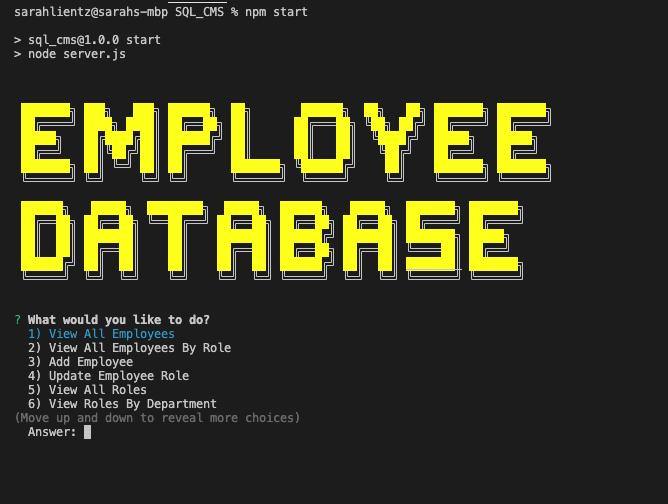

# SQL_CMS
Business content management system(cms) using backend development with Node.js, Inquirer, and MySQL

## Welcome to my SQL Content Management System(CMS) 

I developed this application from scratch to give non-developers an easy way to view and interact with employee data. The functionality of this backend interface is all from the command-line. With a simple tap of the keyboard, the employer can quickly and efficiently view all their departments, roles, and employees. My application also offers the capability to add departments, roles and employees. Enjoy!

### VIDEO DEMO
  * Enjoy a video walkthrough of my backend cms here:

     [SQL CMS VIDEO DEMO](https://watch.screencastify.com/v/WWa58kjBX4MilSudn3s3)

  
    

### PREVIEW

* 

